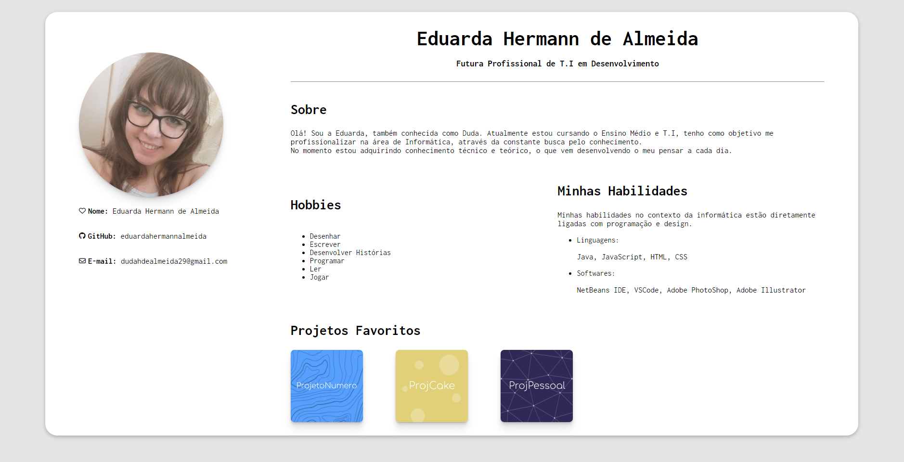

### Descrição:
O repositório LandingPage armazena minha Landing Page, com informações básicas ao respeito de meus conhecimentos e gostos pessoais, foi um projeto proposto e solicitado pelo professor no Curso Técnico de Informática do Colégio ULBRA São Lucas. O objetivo da página é mostrar minhas habilidades e conhecimentos ao leitor do site, porém também junto de hobbies, ou seja, gostos pessoais.

## Ficha Ténica:

Desenvolvedor(a): @eduardahermannalmeida 

Linguagens:

Software:

Ícones:

https://fontawesome.com

Header/Footer (README.md):

https://leviarista.github.io/github-profile-header-generator/

## Preview:

